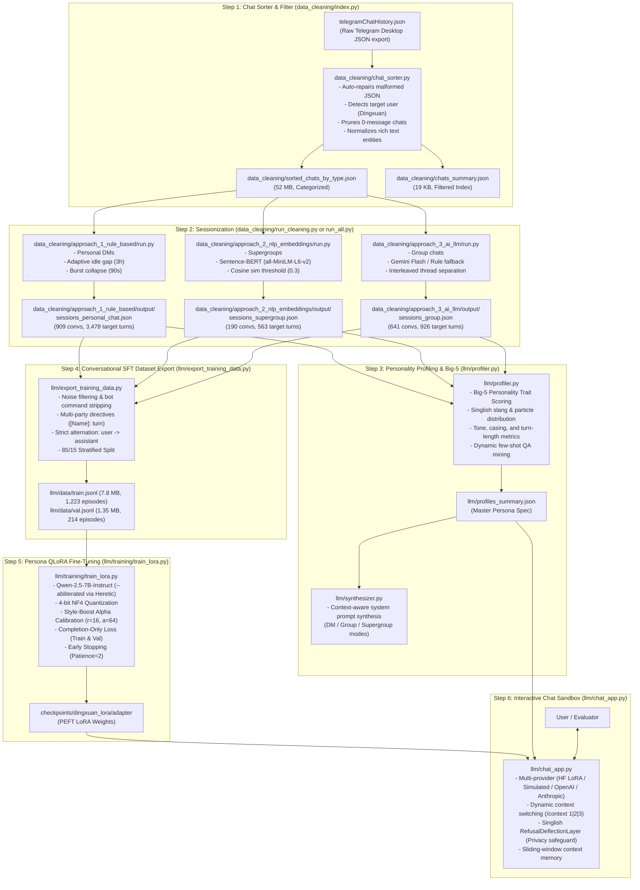

# AI Clone: Complete End-to-End Pipeline & Training Runbook

This guide is the master operational manual for the **AI Clone** project. It provides exact, step-by-step instructions for:
1. **Scenario A**: Setting up and training on a **fresh device with an NVIDIA GPU** (or Google Colab / RunPod / Lambda) using pre-compiled datasets.
2. **Scenario B**: Updating the pipeline from scratch with a **new `telegramChatHistory.json` export** (running raw sorting, 3 sessionization approaches, profiling, dataset compilation, and model fine-tuning).

---

## Table of Contents
1. [End-to-End Architecture & Data Flow](#1-end-to-end-architecture--data-flow)
2. [Prerequisites & Environment Setup](#2-prerequisites--environment-setup)
3. [Scenario A: Quick Setup & Training on Another GPU Device](#3-scenario-a-quick-setup--training-on-another-gpu-device)
4. [Scenario B: Full Pipeline from Updated Telegram Export](#4-scenario-b-full-pipeline-from-updated-telegram-export)
   - [Step 0: Exporting Raw Chat History from Telegram](#step-0-exporting-raw-chat-history-from-telegram)
   - [Step 1: Raw Chat Sorting & Filtering (`data_cleaning/index.py`)](#step-1-raw-chat-sorting--filtering-data_cleaningindexpy)
   - [Step 2: Sessionization via All 3 Approaches (`run_all.py` / `data_cleaning/run_cleaning.py`)](#step-2-sessionization-via-all-3-approaches-run_allpy--data_cleaningrun_cleaningpy)
   - [Step 3: Personality Profiling & Big-5 Scoring (`llm/profiler.py`)](#step-3-personality-profiling--big-5-scoring-llmprofilerpy)
   - [Step 4: Conversational SFT Dataset Export (`llm/export_training_data.py`)](#step-4-conversational-sft-dataset-export-llmexport_training_datapy)
   - [Step 5: Persona QLoRA Fine-Tuning (`llm/training/train_lora.py`)](#step-5-persona-qlora-fine-tuning-llmtrainingtrain_lorapy)
   - [Step 6: Chatting with Your Clone (`llm/chat_app.py`)](#step-6-chatting-with-your-clone-llmchat_apppy)
   - [Step 7: Running Unit & Integration Tests](#step-7-running-unit--integration-tests)
5. [Master One-Liner Command Sequences](#5-master-one-liner-command-sequences)
6. [Pipeline Script & Hyperparameter Cheat Sheet](#6-pipeline-script--hyperparameter-cheat-sheet)
7. [Troubleshooting, Common Pitfalls & FAQ](#7-troubleshooting-common-pitfalls--faq)

---

## 1. End-to-End Architecture & Data Flow



---

## 2. Prerequisites & Environment Setup

### System Requirements
- **Python**: 3.10+ (tested on Python 3.10 through 3.14).
- **RAM**: Minimum 8 GB (16 GB recommended for sentence embeddings).
- **Disk Space**: ~2 GB free disk space for raw data, session outputs, and training datasets (excluding downloaded base model checkpoints).
- **GPU (Optional for steps 1-4 & 6; Required for Step 5 Fine-Tuning)**:
  - NVIDIA GPU with **$\ge 8$ GB VRAM** (RTX 3060, 3070, 4060, 4070, 4080, 4090, or Cloud A10/T4/A100).
  - Steps 1, 2, 3, 4, 6, and 7 run 100% locally on CPU without a GPU.

### Virtual Environment Setup
Always use an isolated virtual environment:

```bash
# Clone or open repository
git clone https://github.com/LiangDingxuan/AI_Clone.git
cd AI_Clone

# Create virtual environment
python -m venv .venv

# Activate on Linux / macOS:
source .venv/bin/activate

# Activate on Windows (PowerShell):
.venv\Scripts\Activate.ps1

# Activate on Windows (CMD):
.venv\Scripts\activate.bat
```

### Dependency Installation Matrix

| Stage | Script / Package | Requirements File | Notes |
| :--- | :--- | :--- | :--- |
| **Core Pipeline & Sorter** | `data_cleaning/index.py`, `data_cleaning/chat_sorter.py`, `run_all.py` | *None* | Python standard library (Zero external dependencies) |
| **Approach 1 (DMs)** | `data_cleaning/approach_1_rule_based/` | *None* | Pure Python rule-based algorithms |
| **Approach 2 (Supergroups)** | `data_cleaning/approach_2_nlp_embeddings/` | `data_cleaning/approach_2_nlp_embeddings/requirements.txt` | `sentence-transformers`, `torch`, `numpy` |
| **Approach 3 (Groups)** | `data_cleaning/approach_3_ai_llm/` | `data_cleaning/approach_3_ai_llm/requirements.txt` | `google-genai` (optional for live Gemini; runs dry-run without it) |
| **Profiler & Exporter** | `llm/profiler.py`, `llm/export_training_data.py` | *None* | Zero external dependencies |
| **QLoRA Fine-Tuning** | `llm/training/train_lora.py` | `llm/training/requirements.txt` | `torch`, `transformers`, `peft`, `trl`, `bitsandbytes`, `accelerate` |

---

## 3. Scenario A: Quick Setup & Training on Another GPU Device

If the repository already contains the exported dataset (`data/train.jsonl` and `data/val.jsonl`), you can skip raw sorting and jump straight into GPU fine-tuning:

### 1. Clone the Repository on the GPU Machine
```bash
git clone https://github.com/LiangDingxuan/AI_Clone.git
cd AI_Clone
```

### 2. Install Training Dependencies
```bash
pip install -r llm/training/requirements.txt
```

### 3. Verify Setup with Dry-Run
Run a fast, zero-GPU dry-run to ensure the datasets, tokenizer configs, and hyperparameter calibrations load properly:
```bash
python llm/training/train_lora.py --dry-run --style-boost --abliterated
```

### 4. Execute QLoRA Fine-Tuning

#### On Linux / Cloud GPU (RunPod, Lambda, Vast.ai):
```bash
bash llm/training/run_training.sh
```

#### On Windows Workstation with NVIDIA GPU:
```cmd
llm\training\run_training.bat
```

#### Custom GPU Command (with specific parameters):
```bash
python llm/training/train_lora.py \
    --abliterated \
    --train-file "llm/data/train.jsonl" \
    --val-file "llm/data/val.jsonl" \
    --output-dir "checkpoints/dingxuan_lora" \
    --style-boost \
    --epochs 3 \
    --batch-size 2 \
    --grad-accum 8 \
    --eval-steps 40 \
    --early-stopping-patience 2 \
    --merge-adapter
```
*(Note: `--abliterated` defaults to `huihui-ai/Qwen2.5-7B-Instruct-abliterated`, abliterated via Heretic to remove corporate RLHF refusal vectors. Pass `--model-name <repo>` to use an alternative base model).*

### 5. On Google Colab (Free T4 or Pro A100)
1. Open [Google Colab](https://colab.research.google.com/) and set runtime to **T4 GPU** (`Runtime` -> `Change runtime type` -> `T4 GPU`).
2. Run in a code cell:
```python
!git clone https://github.com/LiangDingxuan/AI_Clone.git
%cd AI_Clone
!pip install -r llm/training/requirements.txt
!python llm/training/train_lora.py --abliterated --style-boost --epochs 3 --merge-adapter

# Download your trained adapter
!zip -r dingxuan_adapter.zip checkpoints/dingxuan_lora/adapter
from google.colab import files
files.download("dingxuan_adapter.zip")
```

### 6. Test Your Trained Clone in the Chat App
```bash
# Chat with the fine-tuned LoRA adapter (using llm/chat_app.py or root chat_app.py):
python llm/chat_app.py --provider hf --adapter checkpoints/dingxuan_lora/adapter

# Or chat with the merged standalone model:
python llm/chat_app.py --provider hf --model checkpoints/dingxuan_lora/merged_model
```

---

## 4. Scenario B: Full Pipeline from Updated Telegram Export

Use this workflow whenever you export an updated chat history from Telegram or rebuild the entire pipeline from scratch.

---

### Step 0: Exporting Raw Chat History from Telegram

1. Open **Telegram Desktop** on your computer.
2. Navigate to **Settings** (`☰` menu -> `Settings`).
3. Click **Advanced** -> scroll down to **Export Telegram data**.
4. In the Export window:
   - **UNCHECK** all media boxes: *Photos, Videos, Voice messages, Video messages, Stickers, GIFs, Files*. (Text only is required; this drastically speeds up export and keeps file size manageable).
   - Under **Location and format**: Select **Machine-readable JSON** (NOT HTML).
   - Click **Export**.
5. Copy the exported `result.json` file to the root of this repository and rename it to:
   ```
   telegramChatHistory.json
   ```

---

### Step 1: Raw Chat Sorting & Filtering (`data_cleaning/index.py` or `index.py`)

Sorts all chats into categories, auto-repairs JSON syntax anomalies, detects Liang Dingxuan (`user5711494385`), normalizes entity formatting, and prunes empty chats ($total\_messages \le 0$).

```bash
python data_cleaning/index.py
# Or using the root convenience wrapper:
python index.py
```

- **Inputs**: `telegramChatHistory.json`
- **Outputs**:
  - `data_cleaning/sorted_chats_by_type.json` (Full categorized export, ~52 MB; mirrored at root)
  - `data_cleaning/chats_summary.json` (Lightweight index of active chats, ~19 KB; mirrored at root)
- **Useful flags**:
  - `--input <path>`: Custom input file path.
  - `--min-messages <N>`: Minimum messages threshold (default `1`).
  - `--exclude-left`: Skip archived/left chats.

---

### Step 2: Sessionization via All 3 Approaches (`run_all.py` / `data_cleaning/run_cleaning.py`)

Sessionizes the continuous message streams into discrete, topic-coherent conversations across DMs, Supergroups, and Groups.

#### Method A: Unified Master Runner (Recommended)

```bash
# Master pipeline (sort + all 3 sessionizers):
python run_all.py --dry-run-llm

# Dedicated cleaning runner (sessionizers only):
python data_cleaning/run_cleaning.py --dry-run-llm

# Live Gemini LLM mode for Approach 3:
# (Linux/macOS):
export GEMINI_API_KEY="your_api_key_here"
python run_all.py

# (Windows PowerShell):
$env:GEMINI_API_KEY="your_api_key_here"
python run_all.py
```

#### Method B: Running Approaches Individually

1. **Approach 1 — Personal DMs (Rule-Based)**:
   ```bash
   python data_cleaning/approach_1_rule_based/run.py --idle-gap 3.0 --burst-window 90
   ```
   *Output*: `data_cleaning/approach_1_rule_based/output/sessions_personal_chat.json` (909 conversations).

2. **Approach 2 — Supergroups (NLP Embeddings)**:
   ```bash
   pip install -r data_cleaning/approach_2_nlp_embeddings/requirements.txt
   python data_cleaning/approach_2_nlp_embeddings/run.py --similarity-threshold 0.3
   ```
   *Output*: `data_cleaning/approach_2_nlp_embeddings/output/sessions_supergroup.json` (190 conversations).

3. **Approach 3 — Group Chats (Contextual Disentanglement)**:
   ```bash
   # Offline dry-run mode:
   python data_cleaning/approach_3_ai_llm/run.py --dry-run

   # Or with live Gemini API:
   python data_cleaning/approach_3_ai_llm/run.py
   ```
   *Output*: `data_cleaning/approach_3_ai_llm/output/sessions_group.json` (641 conversations).

---

### Step 3: Personality Profiling & Big-5 Scoring (`llm/profiler.py`)

Extracts quantitative linguistic habits (turn length, casing, punctuation, Singlish particles like `ah`, `sia`, `cuz`, `idk`), computes academic Big-5 personality traits (0.0 to 1.0), and mines representative few-shot QA pairs across all 3 contexts.

```bash
python llm/profiler.py
```

- **Inputs**: Output session files from Steps 2A, 2B, 2C.
- **Outputs**: `llm/profiles_summary.json` (12 KB, mirrored at root `profiles_summary.json`).
- **Inspect Synthesized Prompts**:
  ```bash
  python llm/synthesizer.py --context dm
  python llm/synthesizer.py --context group
  python llm/synthesizer.py --context supergroup
  ```

---

### Step 4: Conversational SFT Dataset Export (`llm/export_training_data.py`)

Converts the 1,740 sessionized conversations into standardized ChatML/messages JSONL files for fine-tuning.

```bash
python llm/export_training_data.py --output-dir llm/data/
```

- **Features**:
  - **Noise Filter**: Strips bot commands (`/start`, `/help`), system events (join/leave, pinned messages), and `<media omitted>` tags.
  - **Multi-Party Directives**: Formats other speakers in group chats as `[Name]: text` and embeds explicit instructions to prevent the clone from confusing third-party statements with direct user prompts.
  - **Strict Alternation**: Guarantees `system` $\rightarrow$ `user` $\rightarrow$ `assistant` sequences ending on Dingxuan assistant turns.
  - **Stratified Split**: 85% train / 15% validation.
- **Outputs**:
  - `llm/data/train.jsonl` (1,223 episodes, 4,270 assistant turns — 7.8 MB; mirrored at root `data/train.jsonl`)
  - `llm/data/val.jsonl` (214 episodes, 697 assistant turns — 1.35 MB; mirrored at root `data/val.jsonl`)
  - `llm/data/training_data_summary.json`

---

### Step 5: Persona QLoRA Fine-Tuning (`llm/training/train_lora.py`)

Fine-tunes the base model in 4-bit precision with persona safeguards:

```bash
# 1. Install GPU dependencies:
pip install -r llm/training/requirements.txt

# 2. Run dry-run validation:
python llm/training/train_lora.py --dry-run --style-boost --abliterated

# 3. Launch training:
# (Linux):
bash llm/training/run_training.sh

# (Windows):
llm\training\run_training.bat
```

- **Key Safeguards & Abliteration**:
  - `--abliterated`: Uses **`huihui-ai/Qwen2.5-7B-Instruct-abliterated`** (abliterated using **Heretic** via Bayesian directional ablation). Instruction-tuned base models embed corporate refusal vectors ("*As an AI language model...*") from corporate RLHF safety training. Abliteration removes these refusal directions directly from the base weights at zero extra compute or VRAM cost, preventing the clone from breaking character during banter or edgy discussions.
  - **In-Character Privacy Preservation**: Crucially, privacy protections (IC number, home address, passwords) are NOT lost—they are handled in-character by our Singlish `RefusalDeflectionLayer` in `llm/chat_app.py` (*"whut why u asking that lol"*), ensuring your clone deflects invasive questions naturally without reverting to corporate AI apologies.
  - `--style-boost`: Calibrates LoRA $r=16, \alpha=64$ ($\alpha/r = 4.0$) and learning rate $1.5\times 10^{-4}$ to amplify Singlish colloquialisms (`ah`, `sia`, `cuz`, `idk`, `yea`) and brevity.
  - **Completion-Only Loss**: Loss is calculated strictly on assistant turns for both train and validation sets.
  - **Early Stopping**: Evaluates every 40 steps, halting training if validation loss diverges for 2 checks (`early_stopping_patience=2`) and restoring the best checkpoint.
- **Outputs**:
  - `checkpoints/dingxuan_lora/adapter` (PEFT adapter weights)
  - `checkpoints/dingxuan_lora/merged_model` (Optional standalone 16-bit weights if `--merge-adapter` is used)

---

### Step 6: Chatting with Your Clone (`llm/chat_app.py` or `chat_app.py`)

Launch the interactive CLI chat sandbox:

```bash
# Chat with your trained clone:
python llm/chat_app.py --provider hf --adapter checkpoints/dingxuan_lora/adapter

# Chat offline with zero GPU / zero API key (Simulated Provider):
python llm/chat_app.py

# Chat using OpenAI API (GPT-4o-mini):
set OPENAI_API_KEY=your_key
python llm/chat_app.py --provider openai --model gpt-4o-mini
```
*(Note: `python chat_app.py` at repository root delegates automatically to `llm.chat_app`).*

**Commands inside chat**:
- `/context [1|2|3]`: Switch context (`1`: DM, `2`: Group, `3`: Supergroup).
- `/stats`: Display quantitative metrics & Big-5 personality scores.
- `/prompt`: View active synthesized system prompt.
- `/clear`: Clear conversation sliding-window buffer.
- `/exit`: Exit chat.

---

### Step 7: Running Unit & Integration Tests

Run the complete test suite (zero external dependencies required):

```bash
python -m unittest discover tests
```

Expected output:
```
Ran 31 tests in 1.40s
OK
```

---

## 5. Master One-Liner Command Sequences

### Linux / macOS (Full End-to-End Pipeline)
```bash
# Step 1 -> Step 2 -> Step 3 -> Step 4 -> Step 7:
python data_cleaning/index.py && python run_all.py --dry-run-llm && python llm/profiler.py && python llm/export_training_data.py && python -m unittest discover tests

# Launch GPU training:
bash llm/training/run_training.sh
```

### Windows PowerShell (Full End-to-End Pipeline)
```powershell
python data_cleaning\index.py; python run_all.py --dry-run-llm; python llm\profiler.py; python llm\export_training_data.py; python -m unittest discover tests

# Launch GPU training:
.\llm\training\run_training.bat
```

---

## 6. Pipeline Script & Hyperparameter Cheat Sheet

| Script | Purpose | Key Flags & Options | Default Value |
| :--- | :--- | :--- | :--- |
| **`data_cleaning/index.py`** | Sorts raw Telegram JSON | `--min-messages`<br>`--exclude-left` | `1`<br>`False` |
| **`run_all.py`** / **`data_cleaning/run_cleaning.py`** | Master sessionizer runner | `--dry-run-llm`<br>`--idle-gap-dm`<br>`--similarity-threshold`<br>`--skip-step1` | `False`<br>`3.0` (hours)<br>`0.30`<br>`False` |
| **`data_cleaning/approach_1_rule_based/run.py`** | Personal chat DM sessionizer | `--idle-gap`<br>`--burst-window` | `3.0` (hours)<br>`90` (seconds) |
| **`data_cleaning/approach_2_nlp_embeddings/run.py`** | Supergroup embedding sessionizer | `--similarity-threshold`<br>`--idle-gap` | `0.30`<br>`4.0` (hours) |
| **`data_cleaning/approach_3_ai_llm/run.py`** | Group chat LLM sessionizer | `--dry-run`<br>`--chunk-size` | `False`<br>`50` (turns) |
| **`llm/profiler.py`** | Metrics, Big-5, & prompt profiler | `None` (outputs `llm/profiles_summary.json`) | — |
| **`llm/synthesizer.py`** | Generates system prompts | `--context [dm\|group\|supergroup]` | `dm` |
| **`llm/export_training_data.py`** | Compiles SFT ChatML JSONL | `--output-dir`<br>`--val-ratio`<br>`--seed` | `llm/data`<br>`0.15`<br>`42` |
| **`llm/training/train_lora.py`** | QLoRA GPU fine-tuning | `--model-name`<br>`--abliterated`<br>`--style-boost`<br>`--lora-r`<br>`--lora-alpha`<br>`--early-stopping-patience`<br>`--merge-adapter`<br>`--dry-run` | `Qwen/Qwen2.5-7B-Instruct` *(or `huihui-ai/Qwen2.5-7B-Instruct-abliterated` if `--abliterated`)*<br>`False`<br>`False`<br>`16`<br>`32`<br>`2`<br>`False`<br>`False` |
| **`llm/chat_app.py`** | Interactive chat interface | `--provider [simulated\|hf\|openai\|anthropic]`<br>`--adapter <path>`<br>`--context [1\|2\|3]` | `simulated`<br>`None`<br>`personal_chat` |

---

## 7. Troubleshooting, Common Pitfalls & FAQ

### 1. Windows Console Unicode / Emoji Encoding (`UnicodeEncodeError: 'charmap'`)
- **Cause**: Windows command prompt defaults to `cp1252`, which fails when printing emojis (e.g. 😂, 👍).
- **Fix**: All scripts include `sys.stdout.reconfigure(encoding="utf-8")`. In PowerShell, you can also run:
  ```powershell
  [Console]::OutputEncoding = [System.Text.Encoding]::UTF8
  ```

### 2. Dangling Closing Braces or Corrupted JSON in Telegram Export
- **Symptom**: `json.decoder.JSONDecodeError: Extra data: line ...`
- **Solution**: `data_cleaning/chat_sorter.py` automatically detects manual edits or trailing braces and triggers an auto-repair routine. If a file is completely corrupted, re-export from Telegram Desktop using Step 0.

### 3. CUDA Out of Memory (OOM) During Fine-Tuning
- **Cause**: GPU VRAM is under 8 GB or batch size is too high.
- **Fix**: Reduce batch size and increase gradient accumulation:
  ```bash
  python llm/training/train_lora.py --batch-size 1 --grad-accum 16 --max-seq-length 1024
  ```

### 4. Gemini API 429 Quota Exhaustion in Approach 3
- **Cause**: Reached Google Gemini free tier rate limits.
- **Fix**: Run with `--dry-run` (or `--dry-run-llm` in `run_all.py`), which uses the rule-based temporal chunking fallback with zero API dependencies.

### 5. Pushing to GitHub Fails Due to Large Files
- **Cause**: Git rejects files over 100 MB.
- **Fix**: Model weights (`*.safetensors`, `checkpoints/`) are excluded in `.gitignore`. The datasets `llm/data/train.jsonl` (7.8 MB) and `llm/data/val.jsonl` (1.35 MB) are lightweight and will push without issue.

### 6. Corporate Refusal Misfires ("As an AI language model..." or over-polite corporate tone)
- **Cause**: Standard instruction-tuned models have corporate RLHF refusal vectors that trigger on casual banter, slang, or sensitive keywords.
- **Fix**: Use `--abliterated` (enabled by default in `llm/training/run_training.sh` and `llm/training/run_training.bat`). This swaps the base model to `huihui-ai/Qwen2.5-7B-Instruct-abliterated` (abliterated using Heretic via Bayesian directional ablation). Corporate refusal boilerplate is eliminated, while legitimate privacy guardrails (IC numbers, passwords) are handled seamlessly by `RefusalDeflectionLayer` in Singlish.
